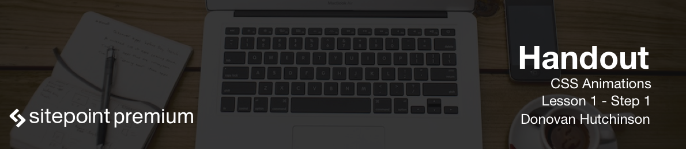

Welcome to **Animating with CSS course**! My name is Donovan Hutchinson, and in this course I will be helping you learn all about how we can use CSS to bring motion to web design. 

You will learn all about the CSS properties involved in animation, such as the `transition`, `keyframe`, and `animation`. Through practical examples, we'll see how to create animations using only CSS, and put together more complex animations. As well as this, we'll cover ways we can make sure we deliver animation only to browsers that can handle it, as well as optimize our animations for performance.

This course will focus on one aspect of CSS. We'll also be using a little HTML and JavaScript, through the course, so I expect some familiarity with how CSS works in general, how we write and structure HTML tags, and some jQuery. You don't need to be an expert in any of these things. Still, if you're familiar with basic CSS, the concepts in this course should build on top of that knowledge. 

I won't be using any special tools or software, just a text editor and a web browser. My text editor of choice is *Sublime Text* and my browser is *Safari*. However, it's up to you which text editor and web browser you want to use as long as you can open and edit HTML, CSS, and JavaScript files. By the end of this course, you will be able to confidently make the case for animation as part of the design process we use on our projects as well as have the technical knowledge of how to build animations yourself.

So, let's get started!

