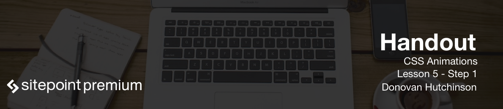

So, we've learned about transitions, put together some keyframes and animations; now it's time to put what we've learned together with more advanced examples. But before we do, let's take a moment to clarify when we might want to use a transition, versus when we might want to use an animation.

There are situations best suited to transitions, and situations best suited to animations. Like any good craft, it's important to understand which tool to choose for the problem being solved. Let's take a look at each.

First, transitions. As we saw earlier, we apply a transition to an element when we want to tell the browser how to animate any changes to the style of the element. The main use of transitions is when interactions occur, or state changes from one state to another. This could mean hover interactions, focusing, or adding and removing classes, resulting in a change of styles on an element. A transition smooths the gap between these changes, as a result transitions are best suited to simpler animations. When something needs to change from a to b, a transition will usually be the quickest and simplest way to achieve this.

On the other side, we have animations. Animations, as we've seen, involve designing sets of keyframes that describe a series of state changes. And the animation property then applies these to elements and controls the keyframe animations. Where a transition will smooth changes to state, animations tend to be standalone. As such, they can play automatically on note or when an element is introduced to a page. This makes them more useful for situations where an animation introduces content or tells a story.

Animations are also more complex, but there's more work involved in building keyframe animations. You need to set out the keyframes, think about the play direction, the fill mode, iterations. Writing keyframes by hand can be complex, but then it offers much greater control. There is flexibility with keyframe animations.

With that in mind, let's look at some ways we can make use of multiple transitions, multiple animations, and even trigger animations on scroll events.

